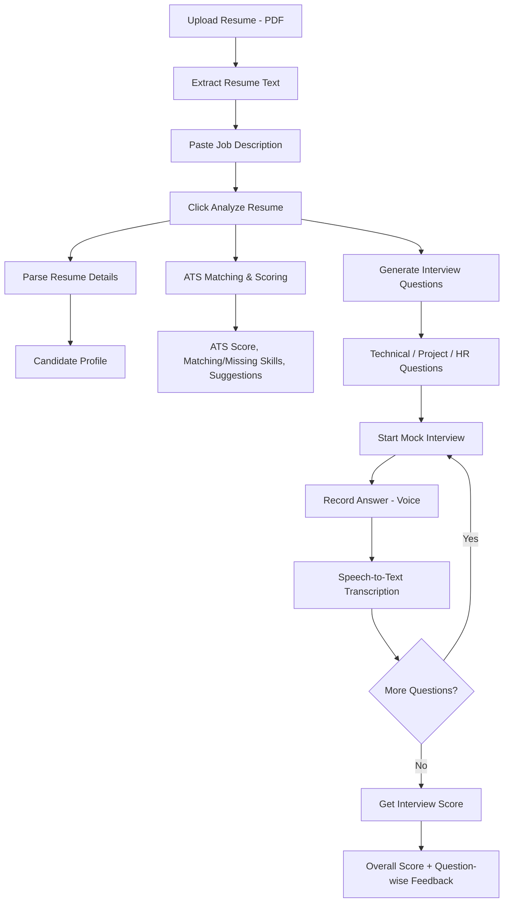

# IntervuX

IntervuX is an AI-powered interview coach that parses resumes, scores them against job descriptions (ATS matching), generates tailored interview questions, and runs voice-based mock interviews with instant AI feedback. Built with Streamlit.

## Project Structure

```text
AI Resume Screener/
├── agents/            # AI Agent modules and logic
├── schemas/           # Pydantic schemas for data validation
├── utils/             # Helper utilities (parsing, API clients, etc.)
├── uploads/           # Directory for uploaded resumes (ignored by git)
├── outputs/           # Directory for generated reports (ignored by git)
├── .env.example       # Example environment variables template
├── .gitignore         # Files and directories ignored by Git
├── app.py             # Streamlit web application entry point
├── README.md          # Project documentation
└── requirements.txt   # Python project dependencies
```

## Tech Stack
- **Python**: 3.13
- **Frontend**: Streamlit
- **Validation**: Pydantic v2
- **Integrations**: Gemini API, OpenAI API, Anthropic API (via corresponding SDKs)
- **Document Parsers**: `pdfplumber` for PDF, `python-docx` for Word documents

## Getting Started

### 1. Prerequisites
Ensure you have Python 3.13 installed. You can verify your version by running:
```bash
python --version
```

### 2. Environment Setup
Clone this repository and create a virtual environment in the project directory:

```bash
# Create virtual environment
python -m venv .venv

# Activate virtual environment
# On Windows (PowerShell):
.venv\Scripts\Activate.ps1
# On Windows (Command Prompt):
.venv\Scripts\activate.bat
# On macOS/Linux:
source .venv/bin/activate
```

### 3. Install Dependencies
```bash
pip install --upgrade pip
pip install -r requirements.txt
```

### 4. Configuration
Copy the `.env.example` file to create a `.env` file:
```bash
cp .env.example .env
```
Open `.env` and fill in your model API keys (e.g., `GEMINI_API_KEY`, `OPENAI_API_KEY`, etc.).

### 5. Running the Application
Launch the Streamlit web application:
```bash
streamlit run app.py
```
By default, the application will be accessible at [http://localhost:8501](http://localhost:8501).


